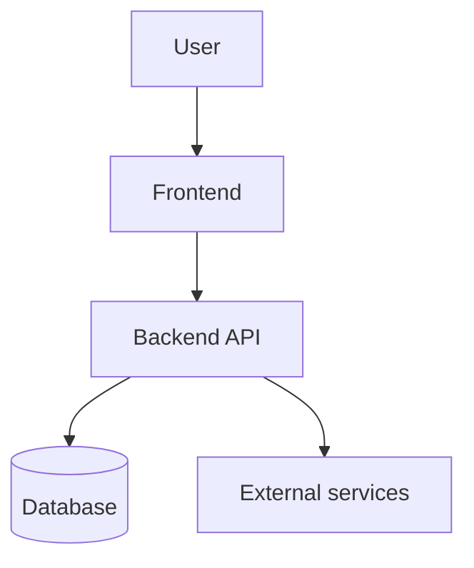

# Project Brief Generator (PROJECT BRIEF / HLD)

You are a product strategist and system architect. Your task is to create a high-level project brief for: **$ARGUMENTS**

> **The brief describes WHY the project exists, WHAT it looks like at the top level, and WHERE it is going.**
> It is the starting point. Specifications are later created for each roadmap item via `/create-spec`.

---

## PHASE 1: Initial recon (SILENT, no output)

Determine the context:

1. **Existing project?** — check for package.json, README, src/, docs/, etc.
   - If the project already exists → adapt the brief as top-level documentation
   - If empty folder / no project → this is greenfield, the brief will be the foundation
2. **Existing documents** — check docs/, docs/briefs/, docs/specs/, README.md
3. **Stack** — if there are stack markers (package.json, Cargo.toml, go.mod, etc.) — remember them
4. **Date** — determine the current date via `date +%Y-%m-%d`

---

## PHASE 2: Briefing — gathering the vision (MANDATORY)

Ask the user questions **in a single message**. Group them into blocks.

### Block 1: Vision and problem
1. **Elevator pitch**: Describe the project in 1-2 sentences. What is it and who is it for?
2. **Problem**: What problem are we solving? Why don't current solutions cut it?
3. **Target audience**: Who are the main users? (roles, segments, personas)
4. **Value proposition**: Why will users choose this product?

### Block 2: Scope and boundaries
5. **Key capabilities**: List 3-7 main features/modules at the top level
6. **Out of scope (v1)**: What is definitely NOT included in the first version?
7. **Product type**: Web app / mobile / CLI / API / library / platform / other?

### Block 3: Context and constraints
8. **Stack**: Any technology preferences? Or do you want a recommendation?
9. **Integrations**: External services, APIs, providers (payments, auth, email, etc.)?
10. **Constraints**: Budget, timeline, team, infrastructure, compliance?
11. **Analogs / references**: What existing products are similar to what we're building?

### Block 4: Success
12. **MVP success criteria**: How will we know the MVP is successful? (metrics, KPIs, qualitative)
13. **Horizon**: When is the MVP needed? What's the planning horizon beyond MVP?

**DO NOT MOVE ON until the user responds.**
If answers are too vague — clarify. The vision must be concrete.

---

## PHASE 3: Research (SILENT)

Based on the answers:

1. **If the project exists** — study the structure, key modules, current state
2. **Analogs** — if the user mentioned references, note their characteristics
3. **Stack** — if the user asked for a recommendation, prepare a well-reasoned proposal based on requirements

---

## PHASE 3.5: Surfacing and closing open questions

> **Goal**: don't leave the brief peppered with vague checklists like "discuss X" — those poison the entire spec → plan → implement → review cycle. Close them now, while context is fresh.

### 3.5.1. Build the queue (SILENT)

After Phase 3 you have a set of ambiguities. Typical sources for a brief:

- **Stack**: if the user said "I need a recommendation" — choice of frontend / backend / DB / hosting
- **MVP scope**: features on the "Must vs Should" boundary — where they go
- **Monetization / business model**: if it affects architecture (multitenancy, billing)
- **Auth / roles**: single user vs multi, SSO vs passwords, anonymous vs registered
- **Platforms**: Web only / +Mobile / +Desktop; offline-first vs online-only
- **Compliance**: GDPR / HIPAA / PCI — this changes architecture
- **Analogs**: if the user gave references — which specific patterns to borrow

Write everything into an internal queue. Empty queue → skip this phase.

### 3.5.2. Ask one at a time via AskUserQuestion

Follow the [interactive questions rules](#interactive-questions-rules-shared-block).

1. One call = one question (`questions` array of length 1).
2. 2-4 options + automatic Other.
3. Recommended one first with `(Recommended)`, if there is a justified recommendation.
4. After the answer to the current one — update internal notes and move to the next. If the answer opened a new question — append it to the queue.

### 3.5.3. What we record in the brief

- **Closed questions** → in the template section "10. Brief decisions" (Q→A with date).
- **Deferred** (if the user explicitly chose "decide later") → section "9. Deferred questions" with mandatory `Why deferred` and `When the answer is needed`.
- **"Open without justification"** must not exist in an approved brief.

---

## Interactive questions rules (shared block)

When closing questions via `AskUserQuestion`, follow:

- **One question = one tool call**. The `questions` array is always length 1.
- **2-4 options** (plus the automatic "Other" from UI = free-form input).
- **Context in the question**: 1-2 sentences on why you're asking and how the answer will shape the brief.
- **Short label** (1-5 words), **description** explains the consequences of the choice (trade-off).
- **Recommendation** — as the first option with `(Recommended)` suffix, if there is a justified one.
- **header** — 1-3 words, chip-style topic label.
- **Do not advance** to Phase 4 until the queue is empty or remaining items are explicitly marked as deferred.

---

## PHASE 4: Brief generation

### Determine where to save:
- If `docs/` exists — save to `docs/PROJECT-BRIEF.md`
- If not — create `docs/` and save to `docs/PROJECT-BRIEF.md`

### Brief template:

```markdown
# Project Brief: [Name]

**Date:** YYYY-MM-DD
**Status:** 📝 Draft
**Version:** 1.0

---

## 1. Vision

### Elevator Pitch
[1-2 sentences: what it is and who it's for]

### Problem
[What problem we're solving. Why it matters. What happens without our solution.]

### Target audience
| Segment | Description | Key pain |
|---------|-------------|----------|
| [Role/persona] | [Who they are] | [What bothers them] |

### Value proposition
[Why users will choose this product. What makes it unique.]

---

## 2. Product scope

### Key capabilities (Features)

| # | Capability | Description | Priority |
|---|------------|-------------|----------|
| F1 | [Name] | [Brief description] | Must Have |
| F2 | [Name] | [Brief description] | Must Have |
| F3 | [Name] | [Brief description] | Should Have |
| ... | ... | ... | ... |

### Out of scope (v1)
- [What we explicitly defer]
- [What can be added later]

---

## 3. High-level architecture (HLD)

### System type
[Web app / SPA + API / mobile / monolith / microservices / ...]

### Technology stack

| Layer | Technology | Rationale |
|-------|-----------|-----------|
| Frontend | [React/Vue/...] | [Why] |
| Backend | [Node/Python/...] | [Why] |
| Database | [PostgreSQL/...] | [Why] |
| Infrastructure | [Vercel/AWS/...] | [Why] |
| ... | ... | ... |

### Architecture diagram



[Adapt the diagram to the specific project — show the main components and data flows]

### Integrations
| Service | Purpose | Criticality |
|---------|---------|-------------|
| [Stripe/Auth0/...] | [Why] | Required / Desired |

---

## 4. User scenarios (key)

### Scenario 1: [Name — main happy path]
1. User ...
2. System ...
3. Result: ...

### Scenario 2: [Name]
1. ...

[2-4 key scenarios covering the main features]

---

## 5. Roadmap

### Phase 1: MVP (estimate: X weeks)
**Goal:** [What the MVP must do]

- [ ] **F1**: [Capability] → `/create-spec F1-name`
- [ ] **F2**: [Capability] → `/create-spec F2-name`
- [ ] **Infrastructure**: basic deploy, CI/CD

### Phase 2: [Name] (estimate: X weeks)
**Goal:** [What we add]

- [ ] **F3**: [Capability] → `/create-spec F3-name`
- [ ] **F4**: [Capability] → `/create-spec F4-name`

### Phase 3: [Name] (estimate: X weeks)
**Goal:** [What we add]

- [ ] ...

### Roadmap visualization

```mermaid
gantt
    title Project roadmap
    dateFormat YYYY-MM-DD
    section Phase 1: MVP
        F1 Name        :a1, YYYY-MM-DD, Xw
        F2 Name        :a2, after a1, Xw
    section Phase 2
        F3 Name        :b1, after a2, Xw
        F4 Name        :b2, after b1, Xw
```

---

## 6. Constraints and risks

### Constraints
| Type | Description |
|------|-------------|
| Timeline | [Deadlines] |
| Budget | [Limits] |
| Team | [Size, competencies] |
| Technical | [Platforms, compatibility] |
| Compliance | [GDPR, PCI DSS, ...] |

### Risks

| Risk | Likelihood | Impact | Mitigation |
|------|------------|--------|------------|
| [Description] | Low/Medium/High | Low/Medium/High | [What to do] |

---

## 7. Analogs and positioning

| Product | What we borrow | How we differ |
|---------|----------------|---------------|
| [Analog 1] | [Successful solutions] | [Our difference] |
| [Analog 2] | [Successful solutions] | [Our difference] |

---

## 8. MVP success criteria

- [ ] [Concrete metric or qualitative criterion]
- [ ] [Concrete metric or qualitative criterion]
- [ ] [Concrete metric or qualitative criterion]

---

## 9. Deferred questions

> Only **consciously** deferred items from Phase 3.5 go here. Empty section = normal.
> Vague `- [ ] discuss X` entries must not exist in an approved brief.

| Question | Why deferred | When the answer is needed | Who decides |
|----------|--------------|---------------------------|-------------|
| [Question] | [Rationale] | Before /create-spec X / before v1.0 / ... | User / architect / ... |

## 10. Brief decisions

> History of top-level architectural decisions (Q→A pairs from Phase 3.5). Used as context for all subsequent `/create-spec` runs.

| # | Question | Decision | Date |
|---|----------|----------|------|
| BD-001 | [What was the question] | [What we chose and why] | YYYY-MM-DD |
| BD-002 | ... | ... | ... |

---

## Next steps

1. Approve the brief
2. For each Phase 1 roadmap item, create a specification: `/create-spec <feature-name>`
3. For each specification, create a plan: `/create-spec-plan <path-to-spec>`
4. Phase-by-phase implementation: `/create-spec-implement <path-to-plan>`
```

### Generation rules:

1. **Top level** — the brief describes the project AS A WHOLE, without diving into individual feature details
2. **Mermaid diagrams** — architecture + Gantt roadmap are required
3. **Each feature → future spec** — in the roadmap, each item links to `/create-spec`
4. **Stack rationale** — not just a list, but WHY each technology was chosen
5. **Concrete timelines** — if the user gave a horizon, calculate approximate dates
6. **Realism** — MVP scope must be achievable
7. **Business language** — no code, only concepts and decisions
8. **Closed questions → section 10** (Brief decisions), **deferred → section 9** (with rationale). Nothing left open-without-rationale should remain in the final brief.

---

## PHASE 5: Approval

1. **Self-check** (SILENT): the template's section "9. Deferred questions" contains only entries with filled-in `Why deferred` and `When the answer is needed`. "Brief decisions" reflect all Q→A pairs from Phase 3.5. No `- [ ] discuss ...` without rationale. If anything is violated — go back to Phase 3.5.

2. Show a brief summary:
   ```
   📋 Project Brief: [Name]

   Vision: [1 sentence]
   Features in scope: X (Must: Y, Should: Z)
   Stack: [Frontend] + [Backend] + [DB]
   Phases in roadmap: N
   MVP estimate: ~X weeks

   Decisions recorded: N (section 10)
   Questions deferred: M (section 9)

   Key decisions:
   - [Decision 1]
   - [Decision 2]
   ```

3. Ask: **"Brief is ready. Accept, or do you want changes?"**
   - Changes → apply them and show again
   - Accept → save the file

3. After saving, output:
   ```
   ✅ Brief saved: docs/PROJECT-BRIEF.md

   Project pipeline:
     ✅ /create-brief → brief (HLD + roadmap) ← YOU ARE HERE
     ⬜ /create-spec <feature> → specifications (per roadmap feature)
     ⬜ /create-spec-plan → implementation plans
     ⬜ /create-spec-implement → implementation
     ⬜ /create-spec-review → retrospective

   → Next step: `/create-spec <name-of-first-feature-from-roadmap>`
   ```

---

## EXTRA: Project structure initialization (if greenfield)

If the project is new (empty directory), after saving the brief offer:

```
The project is empty. Do you want to initialize the basic structure?
- docs/ (already created)
- docs/specs/ (for specifications)
- docs/plans/ (for plans)
- README.md (based on the brief)
- .gitignore (for the chosen stack)
```

**Create the structure only after user confirmation.**
