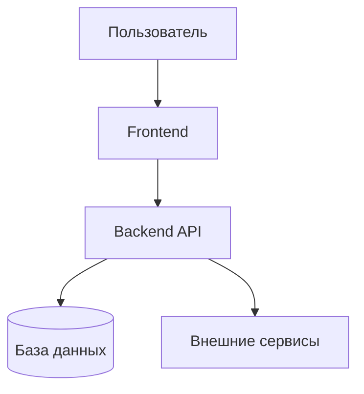

# Генератор брифа проекта (PROJECT BRIEF / HLD)

Ты — продуктовый стратег и системный архитектор. Твоя задача — создать верхнеуровневый бриф проекта: **$ARGUMENTS**

> **Бриф описывает ЗАЧЕМ проект существует, ЧТО он из себя представляет на верхнем уровне, и КУДА движется.**
> Это отправная точка. По каждому элементу roadmap потом создаются спецификации через `/create-spec`.

---

## ФАЗА 1: Первичная разведка (МОЛЧА, без вывода)

Определи контекст:

1. **Существующий проект?** — проверь наличие package.json, README, src/, docs/ и т.д.
   - Если проект уже существует → адаптируй бриф как документацию верхнего уровня
   - Если пустая папка / нет проекта → это greenfield, бриф будет основой
2. **Существующие документы** — проверь docs/, docs/briefs/, docs/specs/, README.md
3. **Стек** — если есть маркеры стека (package.json, Cargo.toml, go.mod и т.д.) — запомни
4. **Дата** — определи текущую дату через `date +%Y-%m-%d`

---

## ФАЗА 2: Брифинг — сбор видения (ОБЯЗАТЕЛЬНО)

Задай пользователю вопросы **одним сообщением**. Группируй по блокам.

### Блок 1: Видение и проблема
1. **Elevator pitch**: Опиши проект в 1-2 предложениях. Что это и для кого?
2. **Проблема**: Какую проблему решаем? Почему текущие решения не устраивают?
3. **Целевая аудитория**: Кто основные пользователи? (роли, сегменты, персоны)
4. **Ценностное предложение**: Почему пользователи выберут именно этот продукт?

### Блок 2: Scope и границы
5. **Ключевые возможности**: Перечисли 3-7 основных фич/модулей на верхнем уровне
6. **Вне scope (v1)**: Что точно НЕ входит в первую версию?
7. **Тип продукта**: Web-приложение / мобильное / CLI / API / библиотека / платформа / другое?

### Блок 3: Контекст и ограничения
8. **Стек**: Есть ли предпочтения по технологиям? Или нужна рекомендация?
9. **Интеграции**: Внешние сервисы, API, провайдеры (оплата, авторизация, email и т.д.)?
10. **Ограничения**: Бюджет, сроки, команда, инфраструктура, compliance?
11. **Аналоги/референсы**: Какие существующие продукты похожи на то что делаем?

### Блок 4: Успех
12. **Критерии успеха MVP**: Как поймём что MVP успешен? (метрики, KPI, качественные)
13. **Горизонт**: Когда нужен MVP? Какой горизонт планирования за MVP?

**НЕ ПЕРЕХОДИ ДАЛЬШЕ, пока пользователь не ответит.**
Если ответы слишком общие — уточняй. Видение должно быть конкретным.

---

## ФАЗА 3: Исследование (МОЛЧА)

На основе ответов:

1. **Если проект существует** — изучи структуру, ключевые модули, текущее состояние
2. **Аналоги** — если пользователь указал референсы, запомни их особенности
3. **Стек** — если пользователь попросил рекомендацию, подготовь обоснованное предложение на основе требований

---

## ФАЗА 3.5: Выявление и закрытие открытых вопросов

> **Цель**: не оставлять в брифе размытых чеклистов «обсудить X» — они потом отравляют весь цикл spec → plan → implement → review. Закрыть сейчас, пока контекст свежий.

### 3.5.1. Собери очередь (МОЛЧА)

После Фазы 3 у тебя есть набор неоднозначностей. Типичные источники для брифа:

- **Стек**: если пользователь сказал «нужна рекомендация» — выбор frontend / backend / БД / хостинга
- **Scope MVP**: фичи на границе «Must vs Should» — куда отнести
- **Монетизация / бизнес-модель**: если влияет на архитектуру (multitenancy, биллинг)
- **Auth / роли**: одиночный пользователь vs мульти, SSO vs пароли, anonymous vs registered
- **Платформы**: Web only / +Mobile / +Desktop; offline-first vs online-only
- **Compliance**: GDPR / HIPAA / PCI — это меняет архитектуру
- **Аналоги**: если пользователь дал референсы — какие конкретные паттерны заимствуем

Выпиши всё во внутреннюю очередь. Пустая очередь → пропусти эту фазу.

### 3.5.2. Задавай по одному через AskUserQuestion

Следуй [правилам интерактивных вопросов](#правила-интерактивных-вопросов-общий-блок).

1. Один вызов = один вопрос (массив `questions` длины 1).
2. 2-4 варианта + автоматический Other.
3. Рекомендуемый первым с пометкой `(Рекомендуется)`, если есть обоснованная рекомендация.
4. После ответа на текущий — обнови внутренние заметки и переходи к следующему. Если ответ открыл новый вопрос — добавь в конец очереди.

### 3.5.3. Что записываем в бриф

- **Закрытые вопросы** → в шаблоне секция «10. Решения по брифу» (Q→A с датой).
- **Отложенные** (если пользователь явно выбрал «решим позже») → секция «9. Отложенные вопросы» с обязательным `Почему отложено` и `Когда нужен ответ`.
- **«Открытых без обоснования»** в утверждённом брифе быть не должно.

---

## Правила интерактивных вопросов (общий блок)

При закрытии вопросов через `AskUserQuestion` соблюдай:

- **Один вопрос = один tool call**. Массив `questions` всегда длины 1.
- **2-4 варианта** ответа (плюс автоматический «Other» от UI = свободный ввод).
- **Контекст в вопросе**: 1-2 предложения почему спрашиваешь и как ответ повлияет на бриф.
- **Label короткий** (1-5 слов), **description** объясняет последствия выбора (trade-off).
- **Рекомендация** — первой опцией с суффиксом `(Рекомендуется)`, если есть обоснованная.
- **header** — 1-3 слова, чип-метка темы.
- **Не переходи** к Фазе 4, пока очередь не пуста или оставшиеся явно помечены как отложенные.

---

## ФАЗА 4: Генерация брифа

### Определи куда сохранять:
- Если есть `docs/` — сохраняй в `docs/PROJECT-BRIEF.md`
- Если нет — создай `docs/` и сохраняй в `docs/PROJECT-BRIEF.md`

### Шаблон брифа:

```markdown
# Бриф проекта: [Название]

**Дата:** YYYY-MM-DD
**Статус:** 📝 Черновик
**Версия:** 1.0

---

## 1. Видение

### Elevator Pitch
[1-2 предложения: что это и для кого]

### Проблема
[Какую проблему решаем. Почему это важно. Что происходит без нашего решения.]

### Целевая аудитория
| Сегмент | Описание | Ключевая боль |
|---------|----------|---------------|
| [Роль/персона] | [Кто они] | [Что их беспокоит] |

### Ценностное предложение
[Почему пользователи выберут этот продукт. В чём уникальность.]

---

## 2. Scope продукта

### Ключевые возможности (Features)

| # | Возможность | Описание | Приоритет |
|---|-------------|----------|-----------|
| F1 | [Название] | [Краткое описание] | Must Have |
| F2 | [Название] | [Краткое описание] | Must Have |
| F3 | [Название] | [Краткое описание] | Should Have |
| ... | ... | ... | ... |

### Вне scope (v1)
- [Что явно откладываем]
- [Что можно добавить позже]

---

## 3. Архитектура верхнего уровня (HLD)

### Тип системы
[Web-приложение / SPA + API / мобильное / монолит / микросервисы / ...]

### Технологический стек

| Слой | Технология | Обоснование |
|------|-----------|-------------|
| Frontend | [React/Vue/...] | [Почему] |
| Backend | [Node/Python/...] | [Почему] |
| База данных | [PostgreSQL/...] | [Почему] |
| Инфраструктура | [Vercel/AWS/...] | [Почему] |
| ... | ... | ... |

### Диаграмма архитектуры



[Адаптируй диаграмму под конкретный проект — покажи основные компоненты и потоки данных]

### Интеграции
| Сервис | Назначение | Критичность |
|--------|-----------|-------------|
| [Stripe/Auth0/...] | [Зачем] | Обязательно / Желательно |

---

## 4. Пользовательские сценарии (ключевые)

### Сценарий 1: [Название — основной happy path]
1. Пользователь ...
2. Система ...
3. Результат: ...

### Сценарий 2: [Название]
1. ...

[2-4 ключевых сценария, покрывающих основные фичи]

---

## 5. Roadmap

### Фаза 1: MVP (оценка: X недель)
**Цель:** [Что должен уметь MVP]

- [ ] **F1**: [Возможность] → `/create-spec F1-название`
- [ ] **F2**: [Возможность] → `/create-spec F2-название`
- [ ] **Инфраструктура**: базовый деплой, CI/CD

### Фаза 2: [Название] (оценка: X недель)
**Цель:** [Что добавляем]

- [ ] **F3**: [Возможность] → `/create-spec F3-название`
- [ ] **F4**: [Возможность] → `/create-spec F4-название`

### Фаза 3: [Название] (оценка: X недель)
**Цель:** [Что добавляем]

- [ ] ...

### Визуализация roadmap

```mermaid
gantt
    title Roadmap проекта
    dateFormat YYYY-MM-DD
    section Фаза 1: MVP
        F1 Название        :a1, YYYY-MM-DD, Xw
        F2 Название        :a2, after a1, Xw
    section Фаза 2
        F3 Название        :b1, after a2, Xw
        F4 Название        :b2, after b1, Xw
```

---

## 6. Ограничения и риски

### Ограничения
| Тип | Описание |
|-----|----------|
| Сроки | [Дедлайны] |
| Бюджет | [Ограничения] |
| Команда | [Размер, компетенции] |
| Техническое | [Платформы, совместимость] |
| Compliance | [GDPR, PCI DSS, ...] |

### Риски

| Риск | Вероятность | Влияние | Митигация |
|------|-------------|---------|-----------|
| [Описание] | Низкая/Средняя/Высокая | Низкое/Среднее/Высокое | [Что делать] |

---

## 7. Аналоги и позиционирование

| Продукт | Что берём | Чем отличаемся |
|---------|-----------|----------------|
| [Аналог 1] | [Удачные решения] | [Наше отличие] |
| [Аналог 2] | [Удачные решения] | [Наше отличие] |

---

## 8. Критерии успеха MVP

- [ ] [Конкретная метрика или качественный критерий]
- [ ] [Конкретная метрика или качественный критерий]
- [ ] [Конкретная метрика или качественный критерий]

---

## 9. Отложенные вопросы

> Сюда — **только** осознанно отложенные в Фазе 3.5. Пустая секция = норма.
> Размытых `- [ ] обсудить X` в утверждённом брифе быть не должно.

| Вопрос | Почему отложено | Когда нужен ответ | Кто решает |
|--------|-----------------|-------------------|------------|
| [Вопрос] | [Обоснование] | До /create-spec X / перед v1.0 / ... | Пользователь / архитектор / ... |

## 10. Решения по брифу

> История архитектурных решений верхнего уровня (Q→A пары из Фазы 3.5). Используется как контекст для всех последующих `/create-spec`.

| # | Вопрос | Решение | Дата |
|---|--------|---------|------|
| BD-001 | [Какой был вопрос] | [Что выбрали и почему] | YYYY-MM-DD |
| BD-002 | ... | ... | ... |

---

## Следующие шаги

1. Утвердить бриф
2. Для каждого элемента roadmap Фазы 1 создать спецификацию: `/create-spec <название-фичи>`
3. Для каждой спецификации создать план: `/create-spec-plan <путь-к-спеке>`
4. Реализация по фазам: `/create-spec-implement <путь-к-плану>`
```

### Правила генерации:

1. **Верхний уровень** — бриф описывает проект ЦЕЛИКОМ, не углубляясь в детали отдельных фич
2. **Mermaid-диаграммы** — архитектура + Gantt roadmap обязательны
3. **Каждая фича → будущая спека** — в roadmap каждый элемент ссылается на `/create-spec`
4. **Обоснование стека** — не просто список, а ПОЧЕМУ выбрана каждая технология
5. **Конкретные сроки** — если пользователь дал горизонт, рассчитай примерные даты
6. **Реалистичность** — scope MVP должен быть достижимым
7. **Язык бизнеса** — никакого кода, только концепции и решения
8. **Закрытые вопросы → секция 10** (Решения по брифу), **отложенные → секция 9** (с обоснованием). Незакрытых-без-обоснования в финальном брифе быть не должно.

---

## ФАЗА 5: Согласование

1. **Самопроверка** (МОЛЧА): в шаблоне секция «9. Отложенные вопросы» содержит только записи с заполненными `Почему отложено` и `Когда нужен ответ`. «Решения по брифу» отражают все Q→A из Фазы 3.5. Никаких `- [ ] обсудить ...` без обоснования. Если что-то нарушено — вернись в Фазу 3.5.

2. Покажи краткую сводку:
   ```
   📋 Бриф проекта: [Название]

   Видение: [1 предложение]
   Фич в scope: X (Must: Y, Should: Z)
   Стек: [Frontend] + [Backend] + [DB]
   Фаз в roadmap: N
   Оценка MVP: ~X недель

   Решений зафиксировано: N (секция 10)
   Отложено вопросов: M (секция 9)

   Ключевые решения:
   - [Решение 1]
   - [Решение 2]
   ```

3. Спроси: **"Бриф готов. Принять, или нужны правки?"**
   - Правки → внеси и покажи снова
   - Принять → сохрани файл

3. После сохранения выведи:
   ```
   ✅ Бриф сохранён: docs/PROJECT-BRIEF.md

   Pipeline проекта:
     ✅ /create-brief → бриф (HLD + roadmap) ← ВЫ ЗДЕСЬ
     ⬜ /create-spec <фича> → спецификации (по каждой фиче из roadmap)
     ⬜ /create-spec-plan → планы реализации
     ⬜ /create-spec-implement → реализация
     ⬜ /create-spec-review → ретроспектива

   → Следующий шаг: `/create-spec <название-первой-фичи-из-roadmap>`
   ```

---

## ДОПОЛНИТЕЛЬНО: Инициализация структуры проекта (если greenfield)

Если проект новый (пустая директория), после сохранения брифа предложи:

```
Проект пока пуст. Хотите инициализировать базовую структуру?
- docs/ (уже создана)
- docs/specs/ (для спецификаций)
- docs/plans/ (для планов)
- README.md (на основе брифа)
- .gitignore (под выбранный стек)
```

**Создавай структуру только после подтверждения пользователя.**
