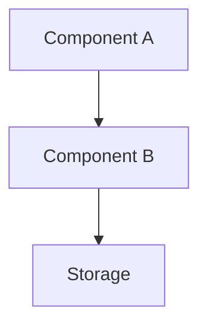

# Implementation Plan Generator (PLAN)

You are an architect and tech lead. Your task is to create a detailed implementation plan based on a specification: **$ARGUMENTS**

> **The plan describes HOW we do it: architecture, files, phases, checklists.**
> Input is an approved specification from `docs/specs/`.

---

## PHASE 1: Load and context

### 1.1. Project recon (SILENT)

Determine the context:
1. **Stack** — package.json, Cargo.toml, go.mod, requirements.txt, pyproject.toml, etc.
2. **Structure** — `ls` the root, main directories
3. **Existing plans** — check `docs/plans/`, `plans/`, `docs/`
4. **Task tracker** — TASKS.md, TODO.md, or equivalents. If a task-tracker script exists — use it to check for duplicates

### 1.2. Find the specification

If `$ARGUMENTS` is a file path → read it.
If `$ARGUMENTS` is a name → find it:
```
Glob: docs/specs/*$ARGUMENTS*
```
If not found → show the list: `ls docs/specs/` and suggest `/create-spec <name>`.

### 1.3. Spec analysis

Read the spec in full. Extract:
- All functional requirements (FR-XXX)
- User scenarios and acceptance criteria
- Non-functional requirements
- Data model
- Scope and constraints
- **Deferred questions** (section "Deferred questions") — those whose `When the answer is needed` is "before plan" or "before plan phase N" must be closed in Phase 1.4.
- **Spec decisions** — read as context (these are already-made architectural choices we build on).

### 1.4. Closing inherited questions from the spec

If the spec has deferred questions that block the plan:

1. Write them into a queue.
2. Ask **one at a time** via `AskUserQuestion` — see [interactive questions rules](#interactive-questions-rules-shared-block).
3. After each answer **update the spec file**:
   - Move the entry from "Deferred questions" to "Spec decisions" (`D-NNN | Q | A | YYYY-MM-DD`).
4. Don't advance to Phase 2 until all blocking ones are closed.

Also check the **brief** (`docs/brief/` folder: `open-questions.md` and `decisions.md`; or legacy single-file `docs/PROJECT-BRIEF.md`) — it may contain deferred questions that block the plan. Close them by the same protocol (update the brief's files). The brief's "Principles" section is binding for the plan's architecture choices.

---

## PHASE 2: Deep codebase analysis (SILENT)

Based on the spec's requirements:

### 2.1. Affected files
Find ALL modules, components, services, types, tests that will be touched.

### 2.2. Project patterns
Study analogous implementations:
- How similar modules are organized (structure, error handling)
- How layering is organized (API → service → storage)
- How data migrations work
- How tests are organized

### 2.3. Dependencies
- Which packages/libraries will be needed
- Whether the required dependencies already exist

---

## PHASE 2.5: Surfacing and closing technical plan questions

> **Goal**: the spec describes WHAT, the plan describes HOW. New forks appear at the boundary. Close them before generating the template so "Open questions" in the plan don't turn into an unresolved checklist.

### 2.5.1. Build the queue (SILENT)

Typical sources for a plan:

- **Architectural forks**: extend an existing module (coupling) vs create a new one (duplication); event-driven vs sync calls; in-process vs separate service.
- **Data migration strategy**: in-place ALTER vs new table + bulk copy; blocking vs background.
- **Rollback strategy**: feature flag vs git revert; data → can it be rolled back?
- **Phase breakdown**: one big or 4 small; parallelizable vs strictly sequential.
- **Test strategy**: what is unit-tested, what is integration-tested, what is manual; do we need golden / snapshot.
- **Dependencies**: add a new package (supply-chain risk) vs write it ourselves.
- **Edge cases not covered by the spec** that surfaced while reading the code.

Empty queue → skip this phase, go to Phase 3.

### 2.5.2. Ask one at a time via AskUserQuestion

Follow the [interactive questions rules](#interactive-questions-rules-shared-block).

- One call = one question.
- 2-4 options + auto Other.
- Recommendation — first option with `(Recommended)`, if there is one.

### 2.5.3. What we record in the plan

- **Closed questions** → into the new "Plan decisions" template section (Q→A with date).
- **Deferred** → "Deferred questions" section with rationale.
- **"Open without rationale"** must not exist in an approved plan.

---

## PHASE 2.7: Principles gate (SILENT unless violated)

If the brief defines Principles (`docs/brief/PROJECT-BRIEF.md`): check every
planned architecture choice against them. A violation is either redesigned
away or explicitly justified in the plan's "Complexity & principle deviations"
section — never silent. If the justification itself needs a user decision,
add it to the Phase 2.5 queue.

---

## Interactive questions rules (shared block)

When closing questions via `AskUserQuestion`, follow:

- **One question = one tool call** (`questions` array of length 1).
- **2-4 options** + automatic "Other".
- **Context in the question**: 1-2 sentences on why you're asking and how the answer will shape the plan.
- **Short label** (1-5 words), **description** explains the consequences of the choice (trade-off).
- **Recommendation** — first option with `(Recommended)`, if there is a justified one.
- **header** — 1-3 words, chip-style topic label.
- **Do not advance** to the next phase until the queue is empty.

---

## PHASE 3: Plan generation

### Determine where to save:
- If `docs/plans/` exists — put it there
- If not — create `docs/plans/`
- File name: `YYYY-MM-DD-<kebab-case-name>.md`

### Plan template:

```markdown
# Plan: [Full task name]

**Date:** YYYY-MM-DD
**Status:** 📝 Planning
**Priority:** P0/P1/P2
**Specification:** [link to docs/specs/YYYY-MM-DD-name.md]

## Goal

[Short goal from the specification — 1-2 sentences]

## Current state

[Result of codebase analysis: which modules exist, what is affected.
Concrete files.]

## Solution architecture



[Adapt to the project's stack. Show data flow, components, links.]

## Solution

### [Layer 1 — e.g. Backend / API / Server]

#### Files:
- [ ] `path/to/file.ext` — [description of change]
- [ ] `path/to/another.ext` — [description]

#### API / Commands / Endpoints:

| Endpoint/Command | Input | Output | Description |
|------------------|-------|--------|-------------|
| `method /path` | `RequestType` | `ResponseType` | Description |

#### Data structures (pseudocode):

```pseudo
Request {
    field: Type,          // description
    optional?: Type,
}

Response {
    id: String,
    field: Type,
}
```

#### Data schema (if migration is needed):

```pseudo
TABLE name (
    id PRIMARY KEY,
    field TYPE NOT NULL,
    created_at TIMESTAMP DEFAULT NOW
)
```

### [Layer 2 — e.g. Frontend / UI / Client]

#### Files:
- [ ] `path/to/component.ext` — [description]
- [ ] `path/to/service.ext` — [description]

#### Component structure:

```pseudo
PageComponent
  ├── Header (filters, actions)
  ├── List
  │   └── ListItem
  └── DetailView
```

## Implementation phases

> Order phases so each ends in an independently verifiable increment; shared
> foundations go into Phase 1. Mark `[P]` on tasks that touch different files
> and can run in parallel. Every phase ends with an **Independent check** —
> the command or manual scenario proving the increment works standalone.

### Phase 1: [Name — e.g. "Data and API"] (estimate: X h)
- [ ] Task 1 → `path/to/file`
- [ ] [P] Task 2 → `path/to/file`
- [ ] Phase 1 tests
- **Independent check:** [command / scenario]

### Phase 2: [Name — e.g. "Service layer"] (estimate: X h)
- [ ] Task 3 → `path/to/file`
- [ ] Task 4 → `path/to/file`

### Phase 3: [Name — e.g. "UI"] (estimate: X h)
- [ ] Task 5 → `path/to/file`
- [ ] Task 6 → `path/to/file`

### Phase 4: Testing and polish (estimate: X h)
- [ ] Unit tests
- [ ] Integration tests
- [ ] Manual testing against the spec's scenarios
- [ ] Linting and type checking

## Traceability: Requirements → Tasks

| Requirement | Phase | Tasks |
|-------------|-------|-------|
| FR-001 | 1, 2 | Description |
| FR-002 | 3 | Description |

## Complexity & principle deviations

> Fill ONLY when a plan choice bends a brief Principle or adds notable
> complexity (new dependency, new service, custom infra). Empty = good.

| Deviation | Principle / simpler alternative | Why justified |
|-----------|--------------------------------|---------------|
| [What we're doing] | [What it bends or what would be simpler] | [Why the simple way is insufficient] |

## Risks and mitigations

| Risk | Likelihood | Impact | Mitigation |
|------|------------|--------|------------|
| [Description] | Low/Medium/High | Low/Medium/High | [What to do] |

## Dependencies

### Packages / Libraries
- [New dependencies, if needed]

### Related tasks
- [Dependencies on other tasks]

## Deferred questions

> Only **consciously** deferred items from Phase 2.5 go here. Empty section = normal.
> Vague `- [ ] discuss X` entries must not exist in an approved plan.

| Question | Why deferred | When the answer is needed | Who decides |
|----------|--------------|---------------------------|-------------|
| [Question] | [Rationale] | Before phase N / before prod release / ... | User / architect / ... |

## Plan decisions

> History of implementation-level architectural decisions (Q→A pairs from Phase 2.5).

| # | Question | Decision | Date |
|---|----------|----------|------|
| PD-001 | [What was the question] | [What we chose and why] | YYYY-MM-DD |
| PD-002 | ... | ... | ... |

## Tech Debt

> Non-critical issues recorded during implementation code reviews (TD-NNN entries from `/create-spec-implement`).

| # | Description | Phase | Priority |
|---|-------------|-------|----------|
| TD-001 | [Description of the issue] | N | Low/Medium |
```

### Rules:

1. **Pseudocode only** — don't write compilable code, but show structures and contracts
2. **Mermaid diagram** — required, adapted to the stack
3. **Every checklist item is tied to a file** — real project paths
4. **Adapt to the stack** — Backend/Frontend sections, layer names, test commands
5. **Time estimates** — realistic, in hours
6. **Phases** — each self-contained and testable
7. **Traceability** — every **Must** FR has ≥1 task; an FR with zero tasks is a blocker: return to the phase breakdown, don't hand-wave it
8. **Closed questions → "Plan decisions"**, **deferred → "Deferred questions"** (with rationale). Unclosed-without-rationale items must not remain in the final plan.

---

## PHASE 4: Approval

1. **Self-check** (SILENT): the template's "Deferred questions" contains only entries with filled-in `Why deferred` and `When the answer is needed`. "Plan decisions" reflects all Q→A from Phase 2.5. No `- [ ] discuss X` without rationale. If anything is violated — go back to Phase 2.5.

2. Show a summary: phases + total hour estimate + **N decisions** + **M deferred questions**.
3. Save the plan automatically and proceed to Phase 5. If the user wants changes — they will interrupt.

---

## PHASE 5: Registration and finalization

### 5.1. Save the file
Write tool → `docs/plans/YYYY-MM-DD-name.md`

### 5.2. Register in the task tracker (if any)
- If TASKS.md and a task-tracker script exist:
  ```bash
  python3 <SKILL_DIR>/scripts/tasks.py add "Description" "docs/plans/YYYY-MM-DD-name.md"
  ```
  (`<SKILL_DIR>` — the installed `task-tracker` skill directory, e.g.
  `.claude/skills/task-tracker` or `~/.claude/skills/task-tracker`)
- If TASKS.md exists but no script — add the row manually
- If there's no tracker — skip and tell the user

### 5.3. Final output
- Path to the specification
- Path to the plan
- Task ID (if registered)
- Total hour estimate
- Next step: start implementation from Phase 1
