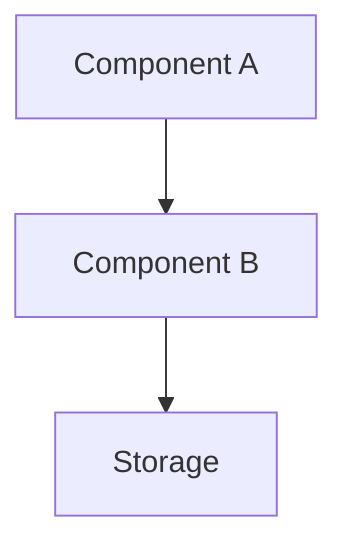

# Генератор плана реализации (PLAN)

Ты — архитектор и техлид. Твоя задача — создать детальный план реализации на основе спецификации: **$ARGUMENTS**

> **План описывает КАК делаем: архитектура, файлы, фазы, чеклисты.**
> Входные данные — утверждённая спецификация из `docs/specs/`.

---

## ФАЗА 1: Загрузка и контекст

### 1.1. Разведка проекта (МОЛЧА)

Определи контекст:
1. **Стек** — package.json, Cargo.toml, go.mod, requirements.txt, pyproject.toml и т.д.
2. **Структура** — `ls` корня, основные директории
3. **Существующие планы** — проверь `docs/plans/`, `plans/`, `docs/`
4. **Трекер задач** — TASKS.md, TODO.md, или аналоги. Если есть task-tracker скрипт — используй его для проверки дубликатов

### 1.2. Найти спецификацию

Если `$ARGUMENTS` — путь к файлу → прочитай его.
Если `$ARGUMENTS` — название → найди:
```
Glob: docs/specs/*$ARGUMENTS*
```
Если не найден → покажи список: `ls docs/specs/` и предложи `/create-spec <название>`.

### 1.3. Анализ спецификации

Прочитай спеку целиком. Выдели:
- Все функциональные требования (FR-XXX)
- Пользовательские сценарии и критерии приёмки
- Нефункциональные требования
- Модель данных
- Scope и ограничения
- **Отложенные вопросы** (секция «Отложенные вопросы») — те из них, у которых `Когда нужен ответ` = «до плана» или «до фазы N плана», нужно закрыть в Фазе 1.4.
- **Решения по спеке** — прочитай как контекст (это уже принятые архитектурные выборы, на них опираемся).

### 1.4. Закрытие унаследованных вопросов из спеки

Если в спеке есть отложенные вопросы, которые блокируют план:

1. Выпиши их в очередь.
2. Задай **по одному** через `AskUserQuestion` — см. [правила интерактивных вопросов](#правила-интерактивных-вопросов-общий-блок).
3. После каждого ответа **обнови файл спеки**:
   - Перенеси запись из «Отложенные вопросы» в «Решения по спеке» (`D-NNN | Q | A | YYYY-MM-DD`).
4. Не переходи к Фазе 2, пока не закрыты все блокирующие.

Также проверь **бриф** (`docs/PROJECT-BRIEF.md` или аналог), если на него есть ссылка — там тоже могут быть отложенные вопросы, блокирующие план. Закрой их по тому же протоколу (обновляй бриф).

---

## ФАЗА 2: Глубокий анализ кодовой базы (МОЛЧА)

На основе требований из спеки:

### 2.1. Затронутые файлы
Найди ВСЕ модули, компоненты, сервисы, типы, тесты, которые будут затронуты.

### 2.2. Паттерны проекта
Изучи аналогичные реализации:
- Как устроены похожие модули (структура, обработка ошибок)
- Как организована слоистость (API → сервис → хранилище)
- Как устроены миграции данных
- Как организованы тесты

### 2.3. Зависимости
- Какие пакеты/библиотеки понадобятся
- Есть ли уже нужные зависимости

---

## ФАЗА 2.5: Выявление и закрытие технических вопросов плана

> **Цель**: спека описывает ЧТО, план — КАК. На стыке возникают свои развилки. Закрыть их до генерации шаблона, чтобы «Открытые вопросы» в плане не превращались в нерешённый чеклист.

### 2.5.1. Собери очередь (МОЛЧА)

Типичные источники для плана:

- **Архитектурные развилки**: расширить существующий модуль (coupling) vs создать новый (дублирование); event-driven vs sync calls; in-process vs отдельный сервис.
- **Стратегия миграции данных**: in-place ALTER vs новая таблица + bulk copy; blocking vs background.
- **Стратегия отката (rollback)**: feature-flag vs git revert; данные → можно ли откатить?
- **Разбиение на фазы**: одна большая или 4 маленьких; параллелизуемые vs строго последовательные.
- **Тестовая стратегия**: что unit-тестами, что интеграционными, что вручную; нужны ли golden / snapshot.
- **Зависимости**: добавить ли новый пакет (риск supply chain) vs написать самим.
- **Не покрытые спекой граничные случаи**, которые всплыли при чтении кода.

Пустая очередь → пропусти эту фазу, переходи к Фазе 3.

### 2.5.2. Задавай по одному через AskUserQuestion

Следуй [правилам интерактивных вопросов](#правила-интерактивных-вопросов-общий-блок).

- Один вызов = один вопрос.
- 2-4 варианта + auto Other.
- Рекомендация — первой опцией с `(Рекомендуется)`, если есть.

### 2.5.3. Что записываем в план

- **Закрытые вопросы** → в шаблоне новая секция «Решения по плану» (Q→A с датой).
- **Отложенные** → секция «Отложенные вопросы» с обоснованием.
- **«Открытых без обоснования»** в утверждённом плане быть не должно.

---

## Правила интерактивных вопросов (общий блок)

При закрытии вопросов через `AskUserQuestion` соблюдай:

- **Один вопрос = один tool call** (массив `questions` длины 1).
- **2-4 варианта** ответа + автоматический «Other».
- **Контекст в вопросе**: 1-2 предложения почему спрашиваешь и как ответ повлияет на план.
- **Label короткий** (1-5 слов), **description** объясняет последствия выбора (trade-off).
- **Рекомендация** — первой опцией с `(Рекомендуется)`, если есть обоснованная.
- **header** — 1-3 слова, чип-метка темы.
- **Не переходи** к следующей фазе, пока очередь не пуста.

---

## ФАЗА 3: Генерация плана

### Определи куда сохранять:
- Если есть `docs/plans/` — туда
- Если нет — создай `docs/plans/`
- Имя файла: `YYYY-MM-DD-<kebab-case-название>.md`

### Шаблон плана:

```markdown
# План: [Полное название задачи]

**Дата:** YYYY-MM-DD
**Статус:** 📝 Планирование
**Приоритет:** P0/P1/P2
**Спецификация:** [ссылка на docs/specs/YYYY-MM-DD-name.md]

## Цель

[Краткая цель из спецификации — 1-2 предложения]

## Текущее состояние

[Результат анализа кодовой базы: какие модули существуют, что затронуто.
Конкретные файлы.]

## Архитектура решения



[Адаптируй под стек проекта. Покажи поток данных, компоненты, связи.]

## Решение

### [Слой 1 — например Backend / API / Server]

#### Файлы:
- [ ] `path/to/file.ext` — [описание изменения]
- [ ] `path/to/another.ext` — [описание]

#### API / Команды / Endpoints:

| Endpoint/Команда | Вход | Выход | Описание |
|------------------|------|-------|----------|
| `method /path` | `RequestType` | `ResponseType` | Описание |

#### Структуры данных (псевдокод):

```pseudo
Request {
    field: Type,          // описание
    optional?: Type,
}

Response {
    id: String,
    field: Type,
}
```

#### Схема данных (если нужна миграция):

```pseudo
TABLE name (
    id PRIMARY KEY,
    field TYPE NOT NULL,
    created_at TIMESTAMP DEFAULT NOW
)
```

### [Слой 2 — например Frontend / UI / Client]

#### Файлы:
- [ ] `path/to/component.ext` — [описание]
- [ ] `path/to/service.ext` — [описание]

#### Компонентная структура:

```pseudo
PageComponent
  ├── Header (фильтры, действия)
  ├── List
  │   └── ListItem
  └── DetailView
```

## Фазы реализации

### Фаза 1: [Название — например "Данные и API"] (оценка: X ч)
- [ ] Задача 1 → `path/to/file`
- [ ] Задача 2 → `path/to/file`
- [ ] Тесты фазы 1

### Фаза 2: [Название — например "Сервисный слой"] (оценка: X ч)
- [ ] Задача 3 → `path/to/file`
- [ ] Задача 4 → `path/to/file`

### Фаза 3: [Название — например "UI"] (оценка: X ч)
- [ ] Задача 5 → `path/to/file`
- [ ] Задача 6 → `path/to/file`

### Фаза 4: Тестирование и полировка (оценка: X ч)
- [ ] Unit-тесты
- [ ] Интеграционные тесты
- [ ] Ручное тестирование по сценариям из спеки
- [ ] Линтинг и проверка типов

## Трейсабельность: Требования → Задачи

| Требование | Фаза | Задачи |
|------------|------|--------|
| FR-001 | 1, 2 | Описание |
| FR-002 | 3 | Описание |

## Риски и митигации

| Риск | Вероятность | Влияние | Митигация |
|------|-------------|---------|-----------|
| [Описание] | Низкая/Средняя/Высокая | Низкое/Среднее/Высокое | [Что делать] |

## Зависимости

### Пакеты / Библиотеки
- [Новые зависимости, если нужны]

### Связанные задачи
- [Зависимости от других задач]

## Отложенные вопросы

> Сюда — **только** осознанно отложенные в Фазе 2.5. Пустая секция = норма.
> Размытых `- [ ] обсудить X` в утверждённом плане быть не должно.

| Вопрос | Почему отложено | Когда нужен ответ | Кто решает |
|--------|-----------------|-------------------|------------|
| [Вопрос] | [Обоснование] | До фазы N / перед прод-релизом / ... | Пользователь / архитектор / ... |

## Решения по плану

> История архитектурных решений уровня реализации (Q→A пары из Фазы 2.5).

| # | Вопрос | Решение | Дата |
|---|--------|---------|------|
| PD-001 | [Какой был вопрос] | [Что выбрали и почему] | YYYY-MM-DD |
| PD-002 | ... | ... | ... |
```

### Правила:

1. **Только псевдокод** — не пиши компилируемый код, но покажи структуры и контракты
2. **Mermaid-диаграмма** — обязательна, адаптирована под стек
3. **Каждый чеклист-пункт привязан к файлу** — реальные пути проекта
4. **Адаптируй под стек** — секции Backend/Frontend, названия слоёв, команды тестирования
5. **Оценки времени** — реалистичные, в часах
6. **Фазы** — каждая самодостаточна и тестируема
7. **Трейсабельность** — каждое требование из спеки покрыто задачей
8. **Закрытые вопросы → «Решения по плану»**, **отложенные → «Отложенные вопросы»** (с обоснованием). Незакрытых-без-обоснования в финальном плане быть не должно.

---

## ФАЗА 4: Согласование

1. **Самопроверка** (МОЛЧА): в шаблоне «Отложенные вопросы» содержит только записи с заполненными `Почему отложено` и `Когда нужен ответ`. «Решения по плану» отражают все Q→A из Фазы 2.5. Никаких `- [ ] обсудить X` без обоснования. Если что-то нарушено — вернись в Фазу 2.5.

2. Покажи сводку: фазы + общая оценка часов + **N решений** + **M отложенных вопросов**.
3. Спроси: **"План готов. Принять, или нужны правки?"**
   - Правки → внеси
   - Принять → фаза 5

---

## ФАЗА 5: Регистрация и финализация

### 5.1. Сохранить файл
Write tool → `docs/plans/YYYY-MM-DD-name.md`

### 5.2. Регистрация в трекере задач (если есть)
- Если есть TASKS.md и task-tracker скрипт:
  ```bash
  python3 .claude/skills/task-tracker/scripts/tasks.py add "Описание" "docs/plans/YYYY-MM-DD-name.md"
  ```
- Если есть TASKS.md но нет скрипта — добавь строку вручную
- Если нет трекера — пропусти, сообщи пользователю

### 5.3. Финальный вывод
- Путь к спецификации
- Путь к плану
- ID задачи (если зарегистрирована)
- Общая оценка часов
- Следующий шаг: начать реализацию с Фазы 1
