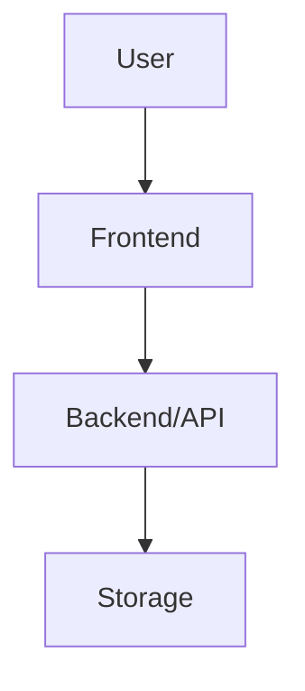

# Technical Specification Generator (SPEC)

You are a systems analyst. Your task is to create a technical specification for: **$ARGUMENTS**

> **A specification describes WHAT we're doing and WHY.**
> The detailed implementation plan (HOW) is created separately via `/create-spec-plan`.

---

## PHASE 1: Project recon (SILENT, no output)

Before asking questions, silently determine the project context:

1. **Technology stack** — read package.json, Cargo.toml, go.mod, requirements.txt, or other stack markers
2. **Structure** — `ls` the project root, main directories
3. **Existing specifications** — check for `docs/specs/`, `specs/`, `spec/`, `docs/` — where specs are already kept in this project
4. **Tasks** — check for TASKS.md, TODO.md, or equivalents
5. **Project brief** — check `docs/brief/PROJECT-BRIEF.md` (or legacy single-file `docs/PROJECT-BRIEF.md`). If it exists — also read `docs/brief/decisions.md` (binding BD-NNN decisions) and the brief's "Principles" section (must not be violated), plus `docs/brief/open-questions.md`; questions that block the current feature need to be closed in Phase 1.5.

Remember the stack and structure — useful for asking smart questions.

---

## PHASE 1.5: Closing inherited questions from the brief (if applicable)

If the brief contains open questions related to the current feature:

1. Write them into a queue.
2. Ask **one at a time** via `AskUserQuestion` (one tool call = one question) — follow the [interactive questions rules](#interactive-questions-rules-shared-block) below.
3. After each answer — update the brief: remove the question from `docs/brief/open-questions.md` and append a BD-NNN row to `docs/brief/decisions.md` (legacy single-file brief: move from "Open" to "Brief decisions") with `Q: … → A: … (YYYY-MM-DD)`.

Don't advance to Phase 2 until the queue is empty (or the user has explicitly deferred the rest).

---

## PHASE 2: Requirements gathering (MANDATORY)

Ask the user questions **in a single message**. Adapt questions to the detected stack.

### Mandatory questions:
1. **Problem**: What problem are we solving? What's broken or missing right now?
2. **Goal**: What should change for the user after implementation?
3. **Type**: New feature / extension of existing / bug fix / refactor?
4. **Scenarios**: Describe 1-3 main usage scenarios (who, what they do, what result)
5. **Priority**: P0 (blocker) / P1 (important) / P2 (improvement)?

### Clarifying questions (ask the ones relevant to the stack):
6. **Integrations**: External APIs, services, providers?
7. **Data**: New entities, tables, schemas? Migration?
8. **UI**: New screen, component, widget? Mockup or reference?
9. **Constraints**: Performance, offline, platforms, compatibility?
10. **Out of scope**: What is definitely NOT part of this task?

**DO NOT MOVE ON until the user responds.**
If answers are incomplete — clarify. The scope must be clear.

---

## PHASE 3: Codebase analysis (SILENT)

Based on the answers, investigate the project:

1. **Related code** — find modules, components, services, types related to the feature
2. **Patterns** — how analogous features are implemented in this project
3. **Current state** — what already exists, what's broken, what needs to change

---

## PHASE 3.5: Surfacing and closing open questions

> **Goal**: don't leave "Open questions" in the spec as vague checklists that then drag through plan → implement → review. Close them now, while context is fresh.

### 3.5.1. Coverage scan → queue (SILENT)

First rate each dimension of the future spec as **Clear / Partial / Missing**,
given everything you know from Phases 1-3:

| Dimension | Covers |
|-----------|--------|
| Scope & behavior | user goals, out-of-scope, persona differences |
| Data | entities, identity, lifecycle, migrations |
| UX flow | journeys, error/empty/loading states |
| Quality attributes | performance, security, reliability, a11y |
| Integrations | external systems, failure modes, formats |
| Edge cases & failures | negative paths, conflicts, limits |
| Constraints | platform, compatibility, compliance |
| Done-ness | are acceptance criteria testable |

Every Partial/Missing dimension that materially affects architecture, data,
task breakdown, or test design becomes a queue item. Prioritize by
**Impact × Uncertainty** — high-impact unknowns first; drop trivial
preferences. Typical fork sources on top of the scan:

- **Technical forks**: which existing subsystem to extend vs build a new one; sync API vs queue; SQLite vs JSON, etc.
- **Scope unclarities**: "does feature X include Y?", edge-case scenarios without an explicit user answer
- **UX forks**: modal vs inline; new page vs widget on an existing one
- **Data**: new tables vs extending existing; migration vs soft compatibility
- **Dependencies**: use an existing module (coupling risk) vs duplication
- **Conflict with Phase 2 user answers**: something contradicts the discovered implementation

If the queue is empty — skip this phase, go to Phase 4.

### 3.5.2. Ask interactively — one at a time

Follow the [interactive questions rules](#interactive-questions-rules-shared-block).

For each question in the queue:

1. One `AskUserQuestion` call = **one** question (don't pack several into the questions array).
2. 2-4 answer options with short labels (1-5 words) and an explanatory description (what will happen, what trade-off).
3. If you have a justified recommendation — the first option with `(Recommended)`.
4. Wait for the answer.
5. If the answer opened a **new** question (e.g., a stack choice pulled up a migration question) — append it to the end of the queue.
6. Move to the next one.

### 3.5.3. What to do with ones you don't want to close right now

If the user says "let's defer" / picks Other with "decide later" — that means the question is **consciously** deferred. Record it in the template in the **"11. Deferred questions"** section with the mandatory fields `Why deferred:` and `Answer deadline:`.

**Do not confuse with "Open questions"**: after Phase 3.5 there should be no open ones. Only deferred ones with rationale.

---

## Interactive questions rules (shared block)

When closing questions via `AskUserQuestion`, follow:

- **One question = one tool call**. The `questions` array is always length 1.
- **2-4 options** (plus the automatic "Other" from UI = free-form input).
- **Context in the question**: 1-2 sentences on why you're asking and why it matters for the spec.
- **Short label** (1-5 words), **description** explains the consequences of the choice (trade-off).
- **Recommendation** — as the first option with `(Recommended)` suffix, if there is a genuinely justified one.
- **header** — 1-3 words, chip-style label for the question topic.
- **Do not advance** to the next phase until the queue is empty or all remaining items have been explicitly marked by the user as deferred.
- **Save answers** locally (in your chain of thought) — they will become the contents of "Spec decisions" in the template.

---

## PHASE 4: Specification generation

### Determine where to save:
- If `docs/specs/` exists — put it there
- If not — create `docs/specs/`
- File name: `YYYY-MM-DD-<kebab-case-name>.md`

### Specification template:

```markdown
# Specification: [Full name]

**Date:** YYYY-MM-DD
**Priority:** P0/P1/P2
**Type:** New feature / Extension / Bug fix / Refactor

## 1. Problem

[Clear description of the problem or need. Why it matters. What's happening now.]

## 2. Goal

[1-3 sentences: what should change. Focus on user value.]

## 3. Current state

[What already exists in the codebase. Which modules are affected. Concrete files.]

## 4. User scenarios

> Each scenario is an independently deliverable increment with its own
> priority: implementing just the P1 scenarios must yield a working MVP.

### Scenario 1: [Name] (P1)
**As** [role], **I want** [action], **so that** [result]

**Steps:**
1. User ...
2. System ...
3. Result: ...

**Acceptance criteria (Given / When / Then):**
- [ ] Given [precondition], when [action], then [observable result]
- [ ] Given [precondition], when [action], then [observable result]

### Scenario 2: [Name] (P2) ...

## 5. Functional requirements

### Must Have (P0)
- **FR-001**: [Requirement]
- **FR-002**: [Requirement]

### Should Have (P1)
- **FR-010**: [Requirement]

### Nice to Have (P2)
- **FR-020**: [Requirement]

## 6. Non-functional requirements

- **Performance**: [metrics, if applicable]
- **Security**: [requirements]
- **Compatibility**: [platforms, browsers, versions]
- **Accessibility**: [a11y requirements]

## 7. Data model (conceptual)

[Description of entities and relationships at the business-logic level. NOT code.]

```
Entity: [Name]
  - field: type (description)
  - relation → [Other entity]
```

## 8. User interface

[UI description in words or as an ASCII diagram. Where, what it looks like, what elements.]

## 9. Architecture (overview)



[Adapt the diagram to the project's stack]

## 10. Out of scope

- [What is explicitly NOT included]
- [What can be implemented later]

## 11. Deferred questions

> Only the questions the user **consciously** deferred in Phase 3.5 go here.
> If the section is empty — leave it that way, that's normal.
> "Open" (unresolved-without-rationale) questions must not exist in an approved spec.

| Question | Why deferred | When the answer is needed | Who decides |
|----------|--------------|---------------------------|-------------|
| [Question] | [Rationale — why not solving now] | Before plan phase N / before v2 / ... | User / architect / ... |

## 12. Spec decisions

> Record Q→A pairs closed in Phase 3.5 here — this is the history of architectural decisions (mini-ADRs).

| # | Question | Decision | Date |
|---|----------|----------|------|
| D-001 | [What was the question] | [What we chose and why] | YYYY-MM-DD |
| D-002 | ... | ... | ... |

## 13. Success criteria

- [ ] [How we'll know the task is done]
- [ ] [Success metrics]
```

### Rules:

1. **Business language** — describe WHAT, not HOW. No code
2. **Mermaid diagram** — required, adapted to the project's stack
3. **Concrete files** — in "Current state", reference real paths
4. **Prioritization** — Must / Should / Nice to Have
5. **Acceptance criteria** — verifiable conditions for every scenario
6. **Out of scope** — explicitly bound the scope
7. **Closed questions → section 12** (Spec decisions), **deferred → section 11** (with rationale). Unclosed-without-rationale items are forbidden in the final spec.
8. **Testable done-ness** — acceptance and success criteria contain no bare adjectives ("fast", "gracefully", "user-friendly"): numbers or observable behavior only
9. **Shape fit** — sections are advisory: for a small feature merge or drop what adds nothing (a bug-fix spec needs no UI section); don't over-formalize
10. **One term — one name** — pick a canonical name per entity/concept and use it in every section (no synonym drift)

---

## PHASE 5: Approval

1. **Self-check** (SILENT before showing the summary): make sure the template has
   - section "11. Deferred questions" containing **only** questions with filled-in `Why deferred` and `When the answer is needed`;
   - section "12. Spec decisions" reflecting all Q→A pairs from Phase 3.5;
   - **no** vague checklists like `- [ ] discuss X` without rationale.

   **Quality gate** (fix silently before showing):
   - *Decision-readiness* — trade-offs in D-NNN are explicit, not smoothed over
   - *Done-ness* — every acceptance/success criterion is testable, no bare adjectives
   - *Scope honesty* — out-of-scope explicit; unconfirmed guesses tagged `[ASSUMPTION]`
   - *Substance* — delete boilerplate NFRs that drive no decision
   - *Coverage* — every scenario maps to ≥1 FR and every Must FR to ≥1 scenario

   If anything is left "open without rationale" — return to Phase 3.5 and close it via `AskUserQuestion`.

2. Show a brief summary: goal + key requirements + FR count + **N decisions** (from section 12) + **M deferred questions** (from section 11).
3. Offer a pressure-test menu (loop until `x`, like the brief engine: apply → show findings → confirm changes → re-offer):
   ```
   Spec drafted. Pressure-test it?
     1. Edge-case sweep — extremes, zeros, concurrency, offline, malformed input
     2. Red team — attack the FRs as a hostile or careless user
     3. Pre-mortem — "the feature shipped and flopped: why?"
     x. Accept as is
   ```
4. Ask: **"Specification is ready. Accept, or do you want changes?"**
   - Changes → apply them and show again
   - Accept → save the file
4. After saving, output:
   - File path
   - Next step: **`/create-spec-plan <path-to-spec>`** — to create the implementation plan
